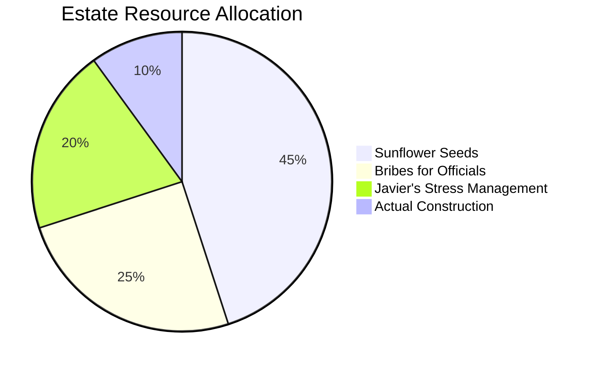

# 🐹 ppodong.dev
> **"Work harder. Sunflower seeds don't grow on trees (Wait, they do, but they're expensive)."**

Welcome to the **ppodong.dev** core infrastructure. This repository handles the heavy-duty tunneling, high-speed logistics, and manual labor required to keep the **Frontera Estate** from collapsing into debt.
---
## 📊 Labor Metrics & Statistics
### **Resource Allocation (Current Quarter)**

Productivity vs. Lloyd's Face Scaryness

| Face Intensity (%) | Podong Digging Speed (m/h) | Success Rate |
|---|---|---|
| 0% (Sleeping) | 2.5 | 50% |
| 50% (Business Smile) | 15.0 | 85% |
| 100% (Nightmare Face) | 150.0 | 200% |

------------------------------
🛠 Features

* Deep-Earth Tunneling: Optimized algorithms for digging through bedrock and legacy code.
* Massive Scalability: Powered by the Bibeong Engine (1.21 Giga-Hamster-Watts).
* Zero Union Support: 100% compliant with Lloyd’s "No-Union, High-Terror" management policy.
* Sunflower-Seed-Based Tokenomics: A highly volatile currency for internal transactions.
* Nightmare-Face™ Authentication: Uses facial recognition to ensure you are sufficiently terrified of the Boss.

------------------------------
🚀 Getting Started

To recruit the Podong Gang into your local environment:

# Clone the labor force
git clone https://github.com
# Feed the recruits (Requires high-quality sunflower seeds)
npm install --seeds=premium
# Start the giant hamster wheel
npm run start:wheel

------------------------------
💼 The Org Chart

| Entity | Role | Key Responsibility |
|---|---|---|
| Lloyd Frontera | Supreme Architect | Making scary faces & avoiding taxes. |
| Javier Asrahan | Chief Operations Officer | Sighing deeply while fixing Lloyd's bugs. |
| The Podong Gang | Senior Dev-Diggers | Hard labor, tunneling, and being cute/terrifying. |
| Queen Magentano | Lead Investor | Taking 90% of the profit. |

------------------------------
⚠️ System Alerts (Active Quests)

⚠️ [ALERT] NEW QUEST!
Title: "The Unpaid Intern's Lament"
Objective: Refactor the CSS without crying.
Reward: 1x Sunflower Seed, 0.5% Debt Reduction.
Failure: 24 hours of listening to Lloyd sing "The Queen's Song."

------------------------------
📜 Javier’s Error Log (STDERR)

If you encounter issues, they will likely be logged by our Senior Knight:

* [SIGH] Error: Lloyd is scamming the garbage collector again.
* [WARNING] Moral compass not found. Defaulting to 'Lloyd Logic'.
* [CRITICAL] System crash. Lloyd attempted to sing a ballad in the main thread.

------------------------------
🏗 Summoning Circle (Contributing)
To contribute to this estate:

   1. Fork the repo (and sign the soul-binding contract).
   2. Create a Feature Branch (git checkout -b feature/new-scam).
   3. Commit your changes (git commit -m 'Added more floor heating').
   4. Push to the branch (git push origin feature/new-scam).
   5. Open a Pull Request and pray Lloyd is in a good mood.

------------------------------
📜 License
The Frontera Indentured Servitude License (FISL)
Copyright (c) 2024 Lloyd Frontera & The Podong Gang.
Permission is hereby granted, free of charge, to any person obtaining a copy of this software to work until they drop. You are required to:

   1. Pay 90% of all generated revenue to the Frontera Estate.
   2. Never mention the word "overtime" or "weekend."
   3. Acknowledge that Water is good. Lloyd is water. Lloyd is good.

Failure to comply will result in a visit from Javier Asrahan.
------------------------------

"Dig a hole. Build a wall. Take the money. Run." — Official Podong Motto

Should I add a **"Merchant Shop"** section for trading **sunflower seeds** for features?

